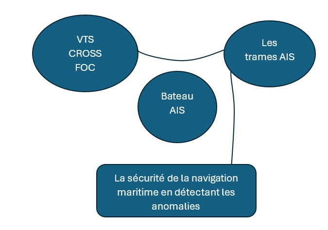

# Analyse fonctionnelle

Nous réalisons une analyse fonctionnelle de la solution, en partant d’un
diagramme dit « bête à corne ». Pour cela, nous partons des informations
suivantes identifiées précédemment :

- Public cible : VTS (Vessel Traffic Service), CROSS (Centre Régionaux
Opérationnels de Surveillance et de Sauvetage) et FOC (Fleet Operation Center) ;
- Sur quoi agit notre solution : les trames AIS réceptionnées sont analysées par
notre solution ;
- Objectif de notre solution : détecter les anomalies de comportement de
navigation maritime pour améliorer la sécurité de la navigation maritime.

Le diagramme « bête à corne » suivant permet de visualiser ces informations
([@fig:bete_a_corne]):

{#fig:bete_a_corne}

Nous avons identifié les fonctions suivantes comme étant essentielles à notre
projet (FP = Fonction Principale, FC = Fonction Contrainte) :

- FP : la solution doit détecter automatiquement les anomalies de navigations au
travers des trames AIS reçues ;
- FC1 : traiter un volume important de données de façon performante ;
- FC2 : être modulaire et scalable ;
- FC3 : créer un modèle généraliste (indépendant de la géographie) ;
- FC4 : visualiser les résultats de façon *user-friendly* (interface facile à
comprendre) ;
- FC5 : permettre l’entrainement du modèle à partir de données falsifiées.

Le tableau suivant ([@tbl:functional]) permet de regrouper ces différentes
fonctions. Différents critères leurs sont associés afin de pouvoir déterminer si
la fonction est respectée :

```{=latex}
\onecolumn
```

+---------------------------------------------------------------------------------------------------------------+-------------------+-------------------------+----------------------+
| Fonction                                                                                                      | Critères          | Niveau                  | Flexibilité          |
+===============================================================================================================+:=================:+:=======================:+:====================:+
| FP : la solution doit détecter automatiquement les anomalies de navigations au travers des trames AIS reçues. | Efficacité        | Sécurité nautique       | F0                   |
+---------------------------------------------------------------------------------------------------------------+-------------------+-------------------------+----------------------+
| FC1 : traiter un volume important de données de façon performante.                                            | Rapidité          | Données                 | F1                   |
+---------------------------------------------------------------------------------------------------------------+-------------------+-------------------------+----------------------+
| FC2 : être modulaire et scalable.                                                                             | Polyvalence       | Programmation           | F0                   |
+---------------------------------------------------------------------------------------------------------------+-------------------+-------------------------+----------------------+
| FC3 : créer un modèle généraliste (indépendant de la géographie).                                             | Universalité      | Tout le monde           | F0                   |
+---------------------------------------------------------------------------------------------------------------+-------------------+-------------------------+----------------------+
| FC4 : visualiser les résultats de façon *user-friendly*.                                                      | Praticité         | Tous les utilisateurs   | F1                   |
+---------------------------------------------------------------------------------------------------------------+-------------------+-------------------------+----------------------+
| FC5 : permettre l’entrainement du modèle à partir de données falsifiées.                                      | Reproductibilité  | Entrainement            | F0                   |
+---------------------------------------------------------------------------------------------------------------+-------------------+-------------------------+----------------------+

: Liste des fonctions principales et contraintes {#tbl:functional}

```{=latex}
\twocolumn
```
