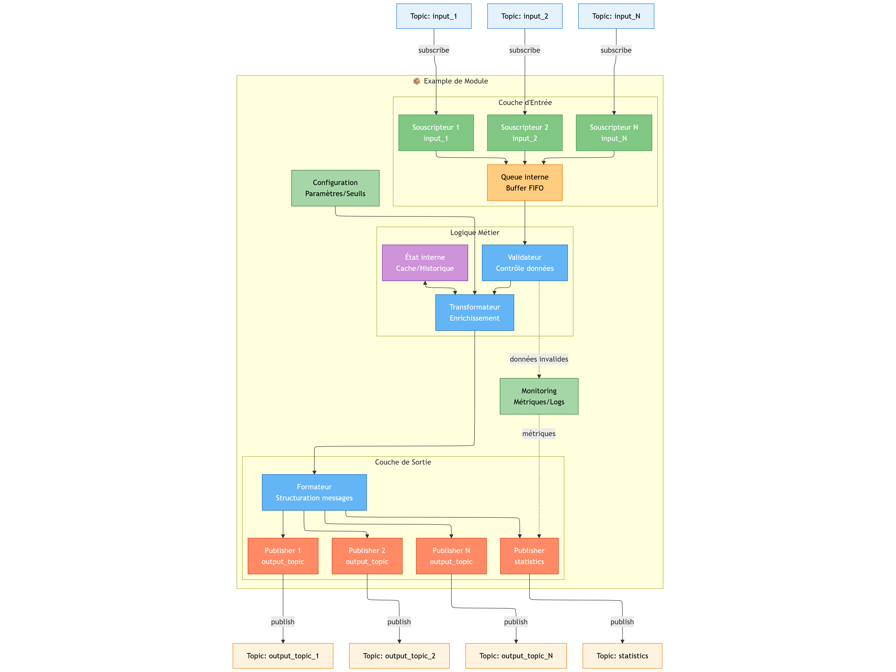

# Architecture technique

L'architecture proposée repose sur un système événementiel distribué utilisant
le pattern publish/subscribe pour traiter en temps réel les trames AIS
(Automatic Identification System) maritimes. Le système permet l'ingestion, le
traitement, l'analyse et la détection d'anomalies dans les données de navigation
maritime, avec une remontée d'alertes vers des opérateurs humains.

## Choix de NATS comme Broker de Messages

Le choix de NATS plutôt que Kafka ou d'autres solutions similaires se justifie
par plusieurs facteurs clés :

- Scalabilité multi-échelle : NATS fonctionne aussi bien sur un Raspberry Pi
(empreinte mémoire ~10MB) que sur des clusters distribués, permettant un
déploiement depuis des stations côtières légères jusqu'aux datacenters
- Simplicité opérationnelle : Contrairement à Kafka qui nécessite ZooKeeper et
une configuration complexe, NATS offre un déploiement minimal avec
auto-découverte des nœuds
- Latence ultra-faible : NATS privilégie la vitesse de transmission (<1ms)
idéale pour le traitement temps réel des données AIS
- Pattern at-most-once natif : Pour les données AIS où la fraîcheur prime sur la
complétude historique, NATS évite la complexité des offsets Kafka

De plus, nous pouvons étendre les fonctionnalités de NATS avec JetStream pour
offrir des fonctionnalités avancées comme la persistance des messages, la
sauvegarde de message pour des abonnements futurs, etc.

## MessagePack pour la Sérialisation

L'utilisation de MessagePack assure :

- Compacité : 50% plus compact que JSON, crucial pour les liaisons radio
limitées
- Performance : Sérialisation/désérialisation 5x plus rapide que JSON
- Interopérabilité : Support multi-langage (Python, Go, C++) facilitant
l'hétérogénéité des modules

Par rapport à Protobuf, qui aurait pu être adapté ici, nous obtenons la
possibilité de faire des désérialisation partielles, utiles pour un
prétraitement des messages. Aussi, il n'est pas obligatoire de recompiler
le schéma, la validation peut se faire directement selon les besoins du
développeur.

## Objectifs d'implémentation

Dans un premier temps, nous allons développer les briques basiques permettant
d'exploiter l'architecture logicielle proposée et en tirer ses forces et ses
faiblesses. Nous cherchons donc à implémenter les modules visibles clairements
sur le schéma d'architecture globale ([@fig:archi_technique]).

Les modules développés correspondent à une architecture générique (voir
[@fig:archi_module]). La partie logique métier est laissée entièrement au choix
du développeur. Dans notre cas, on pourra citer l'example de l'enrichisseur qui
calculera la vitesse en fonction des positions géographique, ou bien du suivi
de session qui gardera un cache en interne pour suivre plusieurs vaisseaux.

```{=latex}
\onecolumn
```

{#fig:archi_technique}

{#fig:archi_module}

```{=latex}
\twocolumn
```
