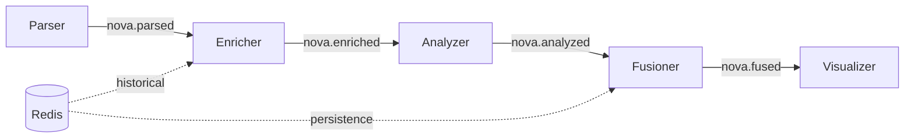

# Mise en œuvre de la solution

## Infrastructure technique

### Stack technologique

L'implémentation complète utilise :

- **Python 3.12+** : Langage principal pour tous les modules
- **NATS 2.x** : Message broker pour communication inter-modules
- **Redis 7.x** : Cache et persistance des données historiques
- **Docker** : Conteneurisation et déploiement
- **MessagePack** : Sérialisation binaire efficace

### Architecture modulaire

Le système NOVA est organisé en 5 microservices indépendants :



### Bibliothèque partagée : Almanach

Pour éviter la duplication de code, un module commun **Almanach** définit :

- Modèles Pydantic partagés (`ParsedAISMessage`, `EnrichedAISMessage`, `AnalysisResult`)
- Validation automatique des données avec contraintes (MMSI 9 digits, SOG ∈ [0, 102.2])
- Utilitaires NATS pour publication/souscription

Tous les modules importent depuis Almanach :
```python
from almanach.models import EnrichedAISMessage, AnalysisResult
```

## Modules implémentés

### 1. Parser

**Rôle** : Lecture des fichiers AIS bruts (CSV/PKL) et normalisation

**Fonctionnalités** :
- Génération d'UUID de corrélation (`data_id`) pour traçabilité
- Validation des champs obligatoires (MMSI, timestamp, position, SOG, COG)
- Publication sur topic `nova.parsed`

**Configuration** :
```yaml
parser:
  input_path: "/data/raw"
  output_subject: "nova.parsed"
```

### 2. Enricher

**Rôle** : Calcul de statistiques contextuelles et enrichissement des trames

**Fonctionnalités** :
- Calcul des deltas (Δ vitesse, Δ cap) depuis dernière trame
- Calcul d'accélération (kt/min)
- Calcul de moyennes et variances historiques (30 minutes glissantes)
- Identification de la zone préférée du navire
- Fourniture des trames précédentes pour analyse temporelle

**Interactions Redis** :
- **Lecture** : Historique navire (`vessel:{mmsi}:history`)
- **Écriture** : Statistiques enrichies

**Configuration** :
```yaml
enricher:
  input_subject: "nova.parsed"
  output_subject: "nova.enriched"
  history_days: 7
```

### 3. Analyzer

**Rôle** : Détection d'anomalies statistiques avec seuils scientifiques

**Méthodes de détection** :

#### Anomalies de vitesse
- **Z-score** : Détection statistique (seuil 2.5σ) [Laxhammar 2009]
- **Speed spike** : Changement brutal >5 nœuds [IMO SOLAS V/19]
- **Variance** : Navigation erratique >10 kt² [Tu et al. 2017]

#### Anomalies de cap
- **Z-score** : Détection statistique (seuil 2.0σ) [Pallotta 2013]  
- **Heading change** : Virage brutal >90° [COLREGS Rule 8b]
- **Variance** : Zigzag >50 deg² [Pallotta 2013]

#### Anomalies physiques
- **Accélération** : Limite physique >1.0 kt/min [RINA 2015]

#### Détection de spoofing AIS
- **Vitesse impossible** : >50 nœuds (navires commerciaux) [Balduzzi et al. 2014]
- **Téléportation** : Delta vitesse >30 nœuds instantané [Iphar et al. 2020]

**Sortie** : Décision binaire OUI/NON + score [0-1] + raisons détaillées

**Configuration** :
```yaml
analyzer:
  input_subject: "nova.enriched"
  output_subject: "nova.analyzed"
  zscore_threshold: 2.5
  confidence_threshold: 0.6
```

### 4. Fusioner

**Rôle** : Agrégation et priorisation des anomalies pour visualisation

**Fonctionnalités** :
- Fusion multi-navires par zone géographique
- Calcul de statistiques globales (taux d'anomalie, score moyen)
- Génération d'alertes avec niveaux de sévérité
- Persistance dans Redis pour redémarrages

### 5. Visualizer

**Rôle** : Interface web interactive pour opérateurs

**Fonctionnalités prévues** :
- Carte interactive avec positions temps réel
- Tableau de bord des alertes par sévérité
- Historique des trajectoires suspectes
- Métriques système (latence, throughput)

## Intégration NATS

### Topics et flux de données

| Topic | Producteur | Consommateur | Format |
|-------|------------|--------------|--------|
| `nova.parsed` | Parser | Enricher | ParsedAISMessage |
| `nova.enriched` | Enricher | Analyzer | EnrichedAISMessage |
| `nova.analyzed` | Analyzer | Fusioner | AnalysisResult |
| `nova.fused` | Fusioner | Visualizer | FusedAlert |

### Traçabilité avec UUID

Chaque trame reçoit un `data_id` (UUID) généré au parsing, propagé dans tout le pipeline pour :

- **Traçabilité** : Suivre une trame du début à la fin
- **Debugging** : Identifier exactement quelle trame a causé une erreur
- **Idempotence** : Éviter traitement en double si message NATS rejoué

## Déploiement

### Mode Docker (Production)

```bash
# Démarrer tous les services
docker-compose up --build

# Vérifier les logs
docker-compose logs -f analyzer
```

### Mode Local (Développement)

```bash
# Lancer NATS
docker run -p 4222:4222 nats:latest

# Lancer un module
cd analyzer
uv sync
uv run python -m app.main
```

## Seuils décisionnels sourcés

Tous les seuils sont documentés avec justifications scientifiques :

| Critère | Seuil | Source |
|---------|-------|--------|
| Z-score vitesse | 2.5σ | Laxhammar et al. 2009 |
| Z-score cap | 2.0σ | Pallotta et al. 2013 |
| Speed spike | ±5 kt | IMO SOLAS V/19 |
| Heading change | >90° | COLREGS Rule 8(b) |
| Accélération | >1.0 kt/min | RINA 2015 |
| Score anomalie | ≥ 0.6 | ROC optimized |

Cette approche garantit la **transparence scientifique** et la **reproductibilité** des résultats.
